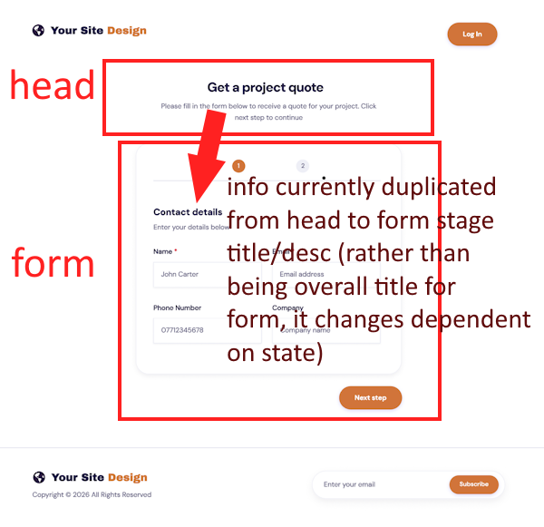

# Railpen Technical Challenge

## Overview

Single page with a multistep form, following the [provided spec](docs/Railpen_Technical_Interview_Test.pdf).

As per instructions, no AI coding tools used (unless the AI responses when Googling for examples and docs count).

## Setup

Initial decision:

1. Only HTML/CSS, served from a set of discrete endpoints that returned HTML for each stage.
2. HTML/CSS/JS, purely client-side, single index.html with some JS sprinkled in.
3. HTML/CSS/JS, purely client-side, but used a JS UI framework (SPA).
4. Combination of either 1 & 2 or 1 & 3

Landed on 2, easy setup and deploy, fewest moving parts (no server, no UI framework).

Vite + Vitest + Playwright + Typescript + Oxfmt + Oxlint.

> [!NOTE]
> ES2024 has been set as the target in the tsconfig, and when deciding whether to use web platform features, I have used [baseline compatibility](https://developer.mozilla.org/en-US/docs/Glossary/Baseline/Compatibility) up to "newly available" as a rough guide, which may potentially harm functionality in some older browsers. I have not used anything with limited availability.

## Alteration to header structure

After writing out initial HTML sketch, there is a structural issue which would need clarification, but which taken as given with no context, causes a few minor technical issues re. implementation. So to take this:

So on the two designs for the pages, there is a heading ("Get a quote"/"Complete your quote"). So this heading seems to be for the form stage. But each stage also has a heading. That heading, it can be assumed, would be for subsections (so maybe there's contact info, then company info, etc, on a single step). But that makes no sense, because the form is being broken into subsections already.

So I've left the area marked "head" in the image above static, as the _page_ header, and replaced the header that is visually within the form with the text from it.
