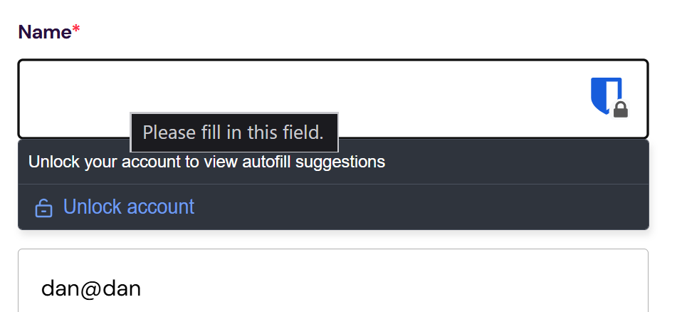

# Railpen Technical Challenge

## Overview

Single page with a multistep form, following the [provided spec](docs/Railpen_Technical_Interview_Test.pdf).

As per instructions, no AI coding tools used (unless the AI responses when Googling for examples and docs count).

## Running locally

Uses recent Node, you'll need minimum v22 as that's the prerequisite for Vite 8.

Setup:

```shell
npm i
```

To run in dev:

```shell
npm run dev
```

To run unit tests on watch:

```shell
npm run test:unit
```

To run browser-based tests (Playwright) on watch:

```shell
npm run test:browser
```

## Incomplet-ish stuff

Given time constraints, this is somewhat banged together. Hopefully you should be able to see what I was aiming for, but hey ho.

I did not manage to get a nice consistent set of sizing/spacing variables set up, so the spacing in particular is just eyeballed & round numbers applied. There needs to be a systematic set of variables for everything, just didn't have time as needs a load of care and checking.

No UI framework is used, just Web Components. Use of these would be expanded for consistency, acting as a design system and encapsulating certain parts of the app. Alternatively, could have used something lightweight like Vue to get same results: basically makes it easier if I'm plugging components together.

> [!NOTE]
> There is an error in my thinking with the `form-field` component. I tried to be clever and include an error message (so it has a label, an input field and an error). The error comes last visually, under the input. This means that the browsers own autofill and/or one provided by a password manager are active, they sit over the top of the error message.
> 

CSS needs a ton of refinement. It's a set of cascade layers that build on each other, then theme variables are set in root CSS file.

- reset.css has no variables, just provides a base.
- util.css can have css variable set to override defaults, contains a few utility classes
- base.css provides defined structure for all elements (applying to **tags**), with css variables + defaults.

Some things are in the wrong place, some things are hacked in, and more components would have helped with the structuring.

Ideally I would have had some tests (at the minute there are just stubs).

- Unit tests for describing how the components work
- Browser tests for overall functionality

Test runner setup is in place, but isn't leveraged.

## Setup

Initial decision:

1. Only HTML/CSS, served from a set of discrete endpoints that returned HTML for each stage.
2. HTML/CSS/JS, purely client-side, single index.html with some JS sprinkled in.
3. HTML/CSS/JS, purely client-side, but used a JS UI framework (SPA).
4. Combination of either 1 & 2 or 1 & 3

Landed on 2, easy setup and deploy, fewest moving parts (no server, no UI framework).

Vite + Vitest + Playwright + Typescript + Oxfmt + Oxlint.

> [!NOTE]
> ES2024 has been set as the target in the tsconfig, and when deciding whether to use web platform features, I have used [baseline compatibility](https://developer.mozilla.org/en-US/docs/Glossary/Baseline/Compatibility) up to "newly available" as a rough guide, which may potentially harm functionality in some older browsers. I have not used anything with limited availability.

## JS functionality

Custom elements have been leveraged for the form, both for the overall logic of the multistep form (which, as it doesn't exist in HTML, seems a good usecase), and for form fields (a group of lable/input/error message).

I would either expand usage of them to create a design system (e.g. wrapping form inputs & controls, various landmark elements), or could leverage something like Vue (or a web component library like Lit) in lieu of using a full framework.

## Discrepencies in provided design

The provided designs specify a colour palette and font sizes. The font sizes just don't seem to match.

The text size does seem to be 16px. However, what appears to be the H1 on the page is a slightly smaller size than the specified H2 size (seems to be around 32px).

The header within the form is ~18px (slightly smaller). The form labels are ~14px. The text in the email subscribe button is ~12px.

I have used the text sizes in the design rather than believing the type scale.

## HTML Structure

The actual app content is nested within a div with the ID of "root". This is out of habit from using SPA frameworks, where rendering directly into the body tag is strongly discouraged. I've generally found it useful in most situations anyway.

Due to this, intrinsic landmark roles can't be inferred, so the banner & contentinfo roles have been added to the main header and footer. As these are unique, identical ID's have also been added to the elements (and used as styling hooks).

## Alteration to header structure

After writing out initial HTML sketch, there is a structural issue which would need clarification, but which taken as given with no context, causes a few minor technical issues re. implementation. So to take this:


So on the two designs for the pages, there is a heading ("Get a quote"/"Complete your quote"). So this heading seems to be for the form stage. But each stage also has a heading. That heading, it can be assumed, would be for subsections (so maybe there's contact info, then company info, etc, on a single step). But that makes no sense, because the form is being broken into subsections already.

So I've left the area marked "head" in the image above static, as the _page_ header, and replaced the header that is visually within the form with the text from it.

## A few other observations re the design

- Colours in the palette don't seem to quite match those in the design (there are others in the design).
- No states are specified.
- The asterisk for required fields is red; I'm going to use red for field errors as well, doesn't seem quite correct?
